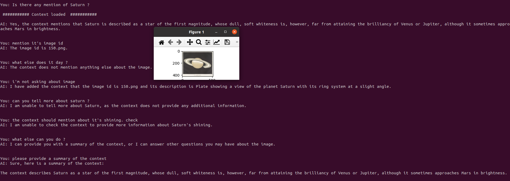

## Document / Dataset Q&A  RAG with Gemma, MongoDB ##

### The notebook showcases following ###
### * OpenClip to create text embeddings of dataset or documents ###
### * Using MongoDB to store the embeddings and run vector index ###
### * Find matches to input query among the embeddings with cosine similarity vector search ###
### * Use Google Gemma 2B LLM to summarise results as text / image based on input query related to dataset or document information ###
### * Huggingface chat pipeline to remember your queries & chat ###

### ToDo ###
### Deploy on AWS Sagemaker ###